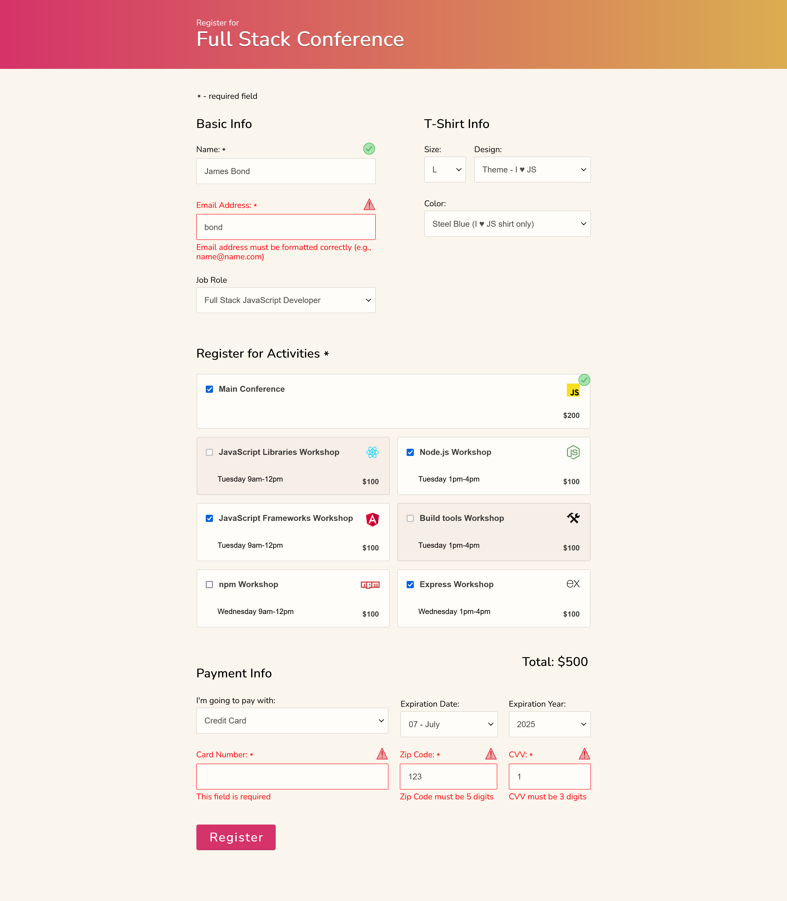

# Form Validation Project

## Overview

This project is a vanilla JavaScript application that demonstrates form validation techniques for a registration form. It includes validation for various input fields such as name, email, activities, and payment details. This was my 3rd project in the Treehouse full stack JavaScript techdegree. The main focus of this project was to implement concepts we learned. For this project, traversing DOM elements was the concept.

## Features

- **Real-time Validation**: As users fill out the form, they receive immediate feedback on the validity of their inputs.
- **Dynamic UI**: The form adapts based on user selections (e.g., showing/hiding fields).
- **Total Cost Calculation**: Users can select activities, and the total cost is dynamically updated.
- **Payment Method Handling**: Users can select their preferred payment method, with relevant fields displayed based on their choice.
- **Accessibility**: The application includes focus management for better accessibility.

## Technologies Used

- HTML
- CSS
- JavaScript (Vanilla)

## Getting Started

### Prerequisites

Make sure you have a modern web browser to run the application.

### Installation

1. Clone the repository or download the ZIP file.
2. Open `index.html` in your web browser.

### Usage

1. Fill out the form with the required information.
2. Observe the real-time validation feedback.
3. Select your desired activities and payment method.
4. Submit the form to see the validation results. (It just logs to the console on submit)

## Example

Here is a preview of the app:

## Acknowledgments

- Thanks to the [Treehouse](https://teamtreehouse.com/) coding community for providing invaluable resources and support.
